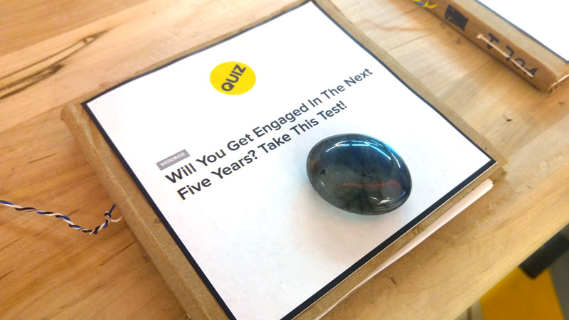
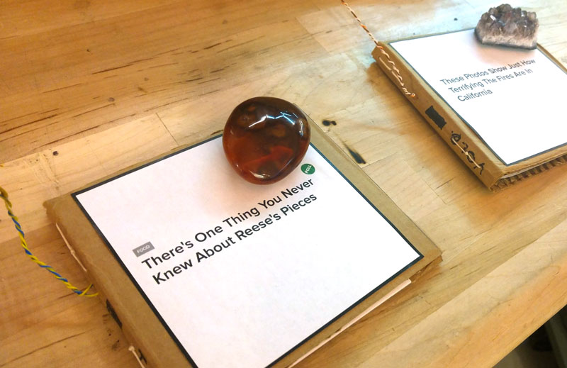
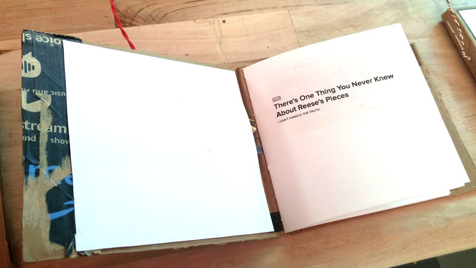
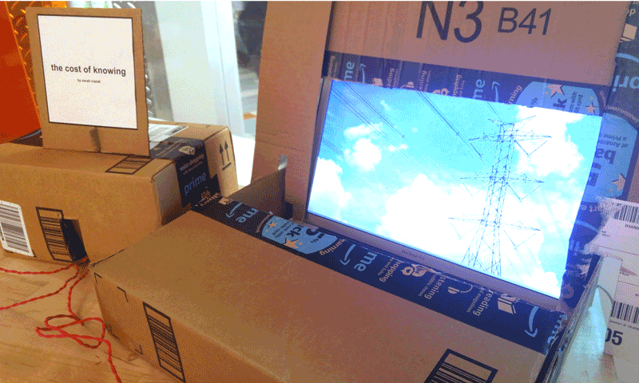
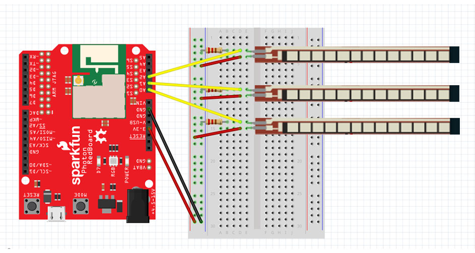
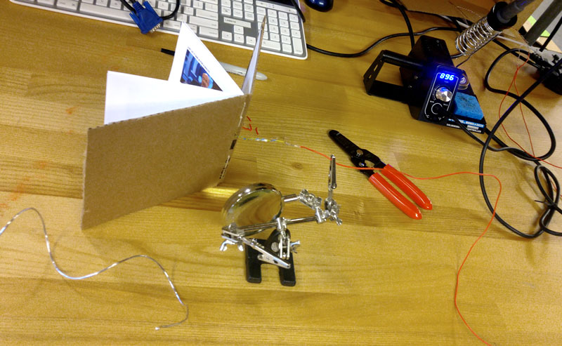

<h1>The Cost of Knowing</h1>

<h2>Concept</h2>

The Cost of Knowing is an interactive installation that illuminates the sources that feed our content addictions: the resources of the physical internet. 

It's ok to judge these clickbait-y books by their covers:

* <a href="https://www.buzzfeed.com/norbertobriceno/engagement-in-five-year?utm_term=.hbzeky24Q#.rm1ObaJ16">Will you get engaged in the next five years? Take this test!</a>
* <a href="https://www.buzzfeed.com/katebubacz/stunning-wildfire-photos?utm_term=.gdDX53d97#.vq5gP5J3K">These Photos Show Just How Terrifying The Fires Are In California?</a>
* <a href="https://www.buzzfeed.com/jamiejirak1/stop-what-youre-doing-because-reeses-pieces-dont-have">There's One Thing You Never Knew About Reese's Pieces</a>

When a user removes the paperweight and opens the book, they might notice that the screen, hidden underneath more Amazon box cardboard, starts to rapidly flash random images of the elements of the physical internet: rare earth mineral mines, factory workers in white clean suits, undersea cables, man hole covers, coal plants, silicon chips, etc. These images appear too quickly to be read individually. Instead, they form a sort of animation where subliminal messages emerge. 

<h2>Technical Design</h2>

The installation hosted three books with three flex sensors, but could be expanded to as many books as you have analog pins to read on your board. 

<h3>The board</h3>

<h3>The flex sensor</h3>

The flex sensor is a resistor, and as it bends, it's resistance changes. On the ground side, there are two outputs. The first is a line from the sensor's ground pin into the analog input on the Photon. Second, we place a 22K resistor between the sensor's ground pin and the ground track of the breadboard. Electrical current flows in the path of least resistance. The 22K resistor is a big resistor value, and it effectively serves as a great big wall that forces the current to flow to the analog pin instead. <a href="https://learn.sparkfun.com/tutorials/flex-sensor-hookup-guide">The documentation suggests</a> any resistor value between 10K and 100K. 

The documentation was really helpful! It's important to only bend the flex sensors in a certain direction, and to avoid bending them at their weak bases.

For the installation, I needed to hide the breadboard, so I soldered a foot of hookup wire to the ends of the flex sensors.  

<h3>The books</h3>

I started by making a few book prototypes to figure out the appropriate size and shape of each book. To design the books, I created screenshots of Buzzfeed articles, and used Adobe InDesign to layout the book spreads. I used the imposition features of Indesign to print the booklets. 

I made the covers out of reclaimed Amazon boxes. I taped the soldered flex sensor inside the books cover, and I was careful to place the tape over the weak base of the sensor. The sensors were only taped down on *one* side. I also taped the wiring and bent it back around, so the wires would pierce the cover's spine. All of the circuitry is on one side of the of the cover, and I covered this up with a sheet of cardstock. This also served as a cover liner. I also glued a sheet of cardstock to the other side of the cover, and slid the the loose, untaped side of the flex sensor underneath the cardstock lining on this side. It was important to avoid taping the sensor down on both sides, because the sensor needed some flexible space to move depending on if the book is open (flat) or closed (bent). 

I did buy one thing for this project from Amazon: a bookmaking kit. It's hard to sew a book together without a good needle! After I got the sensors into the covers and glued down the cover lining, I used the bookmaking kit and <a href="https://www.youtube.com/watch?v=aWHkY5jOoqM">this saddle stitching tutorial</a> to sew the books together with waxed thread.

<h3>The installation</h3>

The installation depended on cardboard to both conceal electronics and create an aesthetic. All the cardboard used for the project came from recycled Amazon boxes (a reference to the hegemony of AWS servers). The books did not want to be closed, so I used crystals as paperweights to hold each book closed.

<h2>Code</h2>

This installation depends on OSC to send a message from the Photon to the Processing sketch over wifi. Below I annotate both the Photon code and the Processing sketch, and explain how to set up OSC.  

<h3>Photon code</h3>

In the Photon code, we start by importing the SimpleOSC library. 

    #include <simple-OSC.h>
  
Then we set up the OSC variables, which we will use to send the OSC message, and analog pins, where we will grab the data from the sensors.   

    UDP udp;
    IPAddress outIp(XX,XXX,XX,XXX); // CHANGE THIS BASED ON YOUR NETWORK (FIND IP IN NETWORK SETTINGS)
    unsigned int outPort = 1234; // MATCH THIS TO PORT # IN PROCESSING
    unsigned int inPort = 8001;

    /* OSC VARIABLES */
    float flexValue0;
    float flexValue1;
    float flexValue2;

    /* FLEX SENSOR */
    int flexSensorPin0 = A0; //analog pin 0
    int flexSensorPin1 = A1; //analog pin 1
    int flexSensorPin2 = A2; //analog pin 2

In the setup function, set up OSC and serial communication. 

    void setup(){
        Serial.begin(115200); // faster data rate
        udp.begin(inPort); //necessary even for sending only
        Serial.println("");
        Serial.println("WiFi connected");
        IPAddress ip = WiFi.localIP();
    }

In the loop, pass the sensor information into variables, and use those variables to create the OSC message. The OSC message will be an array of 3 float values. 

    void loop(){

        flexValue0 = analogRead(flexSensorPin0);
        flexValue1 = analogRead(flexSensorPin1);
        flexValue2 = analogRead(flexSensorPin2);
        
        // set up the message
        OSCMessage outMessage("/photon");

		// add message 1x1
        outMessage.addFloat(flexValue0);
        outMessage.addFloat(flexValue1);
        outMessage.addFloat(flexValue2);
 
        // finish the message
        outMessage.send(udp,outIp,outPort);
    }

<a href="processing/costofknowing/thecostofknowing.pde">View the Photon code here.</a>

<h3>Processing code</h3>

In Processing, we set up OSC and create our variables:

    import netP5.*;
    import oscP5.*;

    OscP5 oscP5;

    /* OSC VARIABLES */
    float flexValue0;
    float openThreshold0 = 1000; // calibrate these numbers based on sensor readings

    float flexValue1;
    float openThreshold1 = 400; 

    float flexValue2;
    float openThreshold2 = 1100; 

    /* IMAGES TO SHOW */
    int counter = 20; // number of images, would be cooler if it could count the folder
    PImage[] imgs = new PImage[counter]; // declary the array, create 20 spots

In the set up function, set up OSC and load the images. Change the sketch's frame rate to adjust the speed of the photo playback:

    void setup() {
        size(1680, 1025);
        background(0);
        frameRate(18);

        oscP5 = new OscP5(this, 1234);

        // load all the images - MUST BE NAMED photo*.jpg and be in sketch > data folder
        for (int i = 1; i < counter; i++) {
            imgs[i] = loadImage("photo" + i + ".jpg");
        	}
        }
    }

Receive the Photon's OSC message and pass it into our Processing variables:

    void oscEvent(OscMessage theOscMessage) {
        if (theOscMessage.checkAddrPattern("/photon")==true) {
            flexValue0 = theOscMessage.get(0).floatValue();
            flexValue1 = theOscMessage.get(1).floatValue();
            flexValue2 = theOscMessage.get(2).floatValue();

            return;
        }
    }

Set up a function to draw the images:

    void imageDrawer() {
        // get a random number between 0 and counter 
        float randomIndexFloat = random(1, counter);
        int randomIndex = int(randomIndexFloat);
        image(imgs[randomIndex], 0, 0); // draw the default image
    }

And we use the float data to trigger the image drawing function at a specific threshold:

    void draw() {
        if (flexValue0 > openThreshold0 || flexValue1 > openThreshold1 || flexValue2 > openThreshold2) {
            imageDrawer();
        } else {
            background(0);
        }
    }

<a href="processing/costofknowing/costofknowing.pde">View the Processing sketch code here.</a>

<h2>Reflection</h2>

For this project, my goal was to continue the research I had began in my "RGB Game" project. In critique, I realized that the concept was intriguing to people, but the twist of the RGB Game lost its magic after a single game play. Also, because the RGB Game presents the connection to the physical internet still within the language of the internet (i.e. bytes created), it remains somewhat esoteric, when the whole goal is make visualize hidden, invisible infrastructures. Taking this feedback to heart, I decided to get very literal - in The Cost of Knowing, the installation responds to the user's interaction by literally spitting out images of the physical internet. I think that this created an interesting visual effect, but I am not sure if the impact really landed in the way I expected. Users expected the screen to respond differently to each book, or even to different pages in the book. I also found that users did not really spend time reading the books, but were more intrigued with the novelty of how much the book had to be open before the screen started playing. If I redo this project, I would think more critically about the role of the screen, and what I could do to encourage visitors to engage with the printed books as if they were on their phones. 

I wanted to avoid buying things to create this project, but realized after the show that most of the materials I received to make it possible were donated through from my generous professors and friends. The donations I relied on could also be extended to the code support I found in online forums and the Creative Commons photographs I used. I think I could have done a better job making the donations of the materials and knowledge more transparent in the presentation.  

For the programming part of this project, I was able to reuse the OSC code I figured out from my midterm. Otherwise, I adapted the flex sensor documentation's program and circuit for my own purposes. I learned more about resistors and voltage dividers while laying out the circuit, which was ultimately pretty simple. The thing that I struggled with was soldering! I had to solder hookup wire to the flex sensor's pins, and since the two pins were very close together and I have never really soldered before, this was a challenge.  

Overall, this project challenged me to make things I had never made before. I really enjoyed working with found materials and inventing solutions on the fly. It was also exciting to combine the technical side of this project with other skills and interests I have, like graphic design and handmade crafts. The concept for this project started off in a very different place, and it became what it was through the advice and collaboration of my advisors and peers. I really enjoyed the brainstorming part of the concept stage, and the feeling of landing on a feasible yet intriguing idea. 

<h2>About this Repo</h2>

This project was created for Mark Olson and Matthew Kenney's Physical Computing / Internet of Things course at Duke in Fall 2017. Thank you to Mark, Matt, and my clasmates for helping me create this project and to think critically about the Internet of Things! 